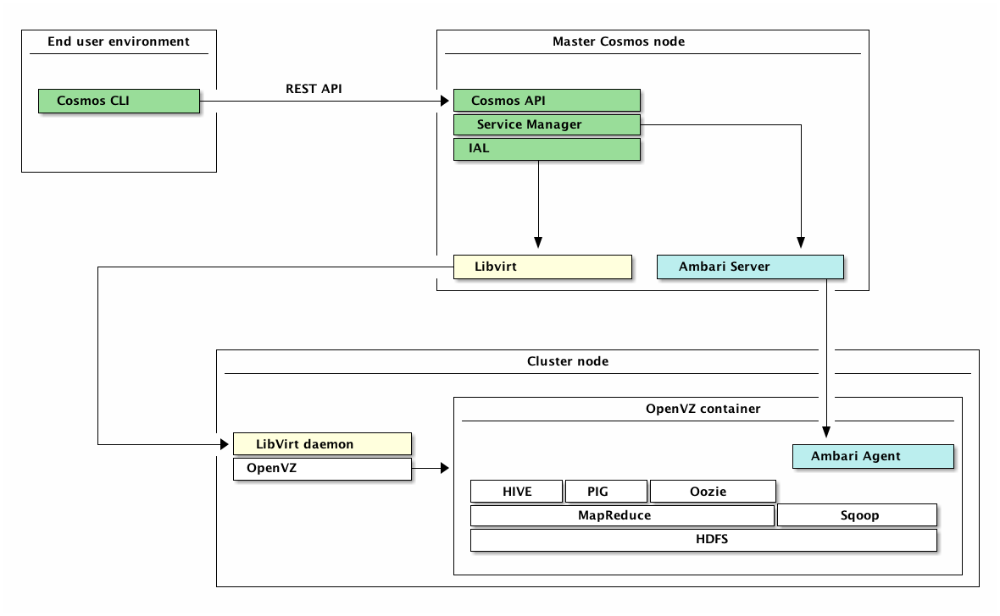

# Cosmos Architecture

## About This Document

This document provides a high-level architecture overview of Cosmos Platform from version 0.10 onward. 

## Introduction

Cosmos is Telefónica Digital's Big Data platform. It aims to become:

* The reference service for exploratory big data analytics across all of Telefónica’s operating
  businesses (OBs)
* The reference big data platform for live services that need to capture large amounts of data and
  analyze them to produce knowledge that will enhance its value proposition

Cosmos Platform is a Hadoop-as-a-Service software platform. It manages both the infrastructure and the
software resources needed in order to provide:

* Hadoop clusters ready to be use by its end-users
* A persistent storage (Infinity) service to save data that needs to live beyond the life of a single
  cluster

For more details on what Cosmos Platform is, please check out Cosmos Platform User Manual.

## Architecture

### Master Cosmos node

The core of Cosmos Platform follows a 3-tier architecture comprised by the following components.

* **Cosmos API**. This component provides the REST APIs that allow the users to consume the services
  implemented by the platform. It provides as well a web interface that may be used to execute a small
  subset of account management actions (manage SSH keys, retrieve API credentials, etc). From the
  logical perspective, the duties of Cosmos API are:
  * User and group management. Credentials and permissions are managed by Cosmos API. 
  * Request authorization. Any API or website request is checked to ensure that only authorized users
    have access to the resources they are granted to. 
  * Quota management. Users and groups may have constraints respect the amount of resources they
    consume. These constraints are represented with quotas that are managed by Cosmos API. 
  * Task management. The resources provided by Cosmos cannot be instantiated immediately. Most of the
    actions requested by the end-users require a long-term task to be executed. The life-cycle of these
    tasks is managed by Cosmos API. 
  * Interaction with Service Manager. Once each request is authorized, each constraint is checked, and the
    task is allocated, the actual action is forwarded to the next tier: Service Manager. 

* **Service Manager**. This component is aimed at managing the Cosmos clusters by orchestrating the necessary
  actions over other components in order to allocate the infrastructure resources and deploy and configure
  the software on each cluster node. Its duties include:
  * Manage cluster life-cycle. Cosmos API may require the creation of new clusters and the termination of
    existing ones. Service Manager is responsible of orchestrating the necessary actions to satisfy these
    requests. 
  * Manage cluster users. End-users may choose to let other users to access their running clusters. This
    means that the corresponding UNIX and HDFS accounts have to be managed. Service Manager is able to
    orchestrate the necessary actions to create and disable user accounts on existing clusters. 
  * Integration with Infrastructure Abstraction Layer and Apache Ambari. Service Manager is not able to
    assume its duties by itself. It requires Infrastructure Abstraction Layer and Apache Ambari services in
    order to do it. 

* **Infrastructure Abstraction Layer** (IAL). This layer is aimed at managing the infrastructure resources
  in an agnostic way. Its duty is to deal with the heterogeneity of the virtualization technologies
  providing an agnostic interface so Service Manager can consume infrastructure resources easily. The
  canonical implementation is based on libvirt+OpenVZ.

These 3-tier core runs on the same server. The tiers communicate among them using JVM interfaces. They are
designed in order to run on the same JVM instance. 

Along with these core components, there is another piece of software shipped with Cosmos: **Cosmos CLI**.
This is a CLI application written in Python that uses the REST API exposed by Cosmos API to transform it
into a command-oriented interface. Its functionalities are packaged in form of Python library, so
third-party applications written in Python can be integrated using its classes and functions instead of
commands. 

### Cluster nodes

The Cluster nodes are those servers which can be part of a cluster once a user requests the creation of a
cluster. The Hadoop daemons that will be part of the cluster do not run directly on the server's operating
system. Instead, a container (a light form of virtualization) is created which will host all of the Hadoop
components. This container is created through OpenVZ.

There is a 1:1 mapping between cluster nodes and OpenVZ containers in order to avoid hardware
oversubscription (which heavily impacts the performance of Hadoop) and to maximize hardware usage, since
Hadoop is able to maximize its performance by using all of the hardware resources of the server (as
opposed to having two containers, each of them with half the actual hardware of the server, which would
create unnecessary virtual network traffic).

We are using the lightweight container virtualization technology to achieve a repeatable, stable
environment which would be very tough to achieve if the bare metal server was used.

Containers do not exists as long as the server isn't being used as part of a cluster. Each container has
a base OpenVZ image which contains the network configuration for the container (static IP) and a stable
RSA identity for SSH connections.

## Cluster deployment procedure

Deployment of a new cluster starts with a REST petition from a client (possibly the CLI) to the Cosmos API.
The API validates the user's credentials, quota and machine availability and proceeds to send the cluster
creation message to the Service Manager.

The Service Manager requests to the IAL the specified number of machines. This triggers libvirt messages
to several cluster nodes which will create the OpenVZ containers in those nodes. The Service Manager now
starts sending messages to the Ambari Server to:

* Bootstrap the machines, which causes the Ambari Server to SSH into the containers to  install, configure
  and start the Ambari Agents
* Create the cluster in Ambari Server, assigns the hosts to the cluster, adds the different services (HIVE,
  HDFS...) and specifies the host component roles (for example, which host will run the NameNode)
* Installs and starts each service

Once this process is finished, the user is able to SSH into the cluster and run as many Hadoop jobs as
necessary.

The following services are supported in compute clusters (a (*) means that the service is compulsory):

* (*) Cosmos User Service
* HCatalog
* (*) Hdfs
* Hive
* (*) Infinity Driver
* (*) MapReduce
* Oozie
* Pig
* Sqoop
* WebHCat
* (*) Yarn
* (*) Zookeeper

## Infinity

Infinity is a special, always-on cluster which contains an HDFS instance. This cluster is used to persist
data that needs to exists after the compute clusters have been destroyed.

Although the servers that form this cluster are considered cluster nodes since the software deployed is
identical, the hardware profile is typically different that those nodes used for compute purposes due to
the different workload profile (higher HDD space, lower RAM, higher network bandwidth).

This clusters also contains some services which aren't available to compute clusters. These services provide
data security in Infinity by validating each request with the user's credentials.
